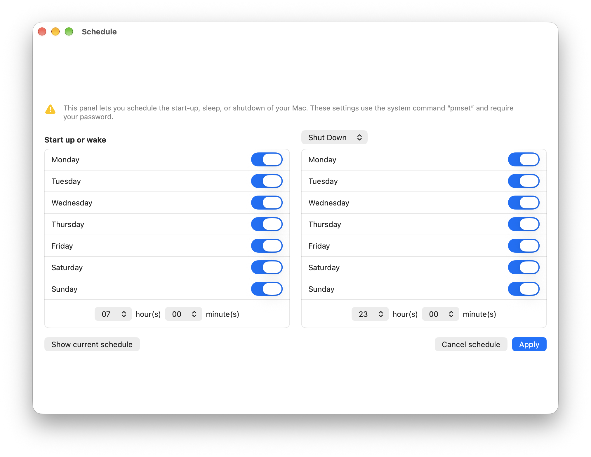
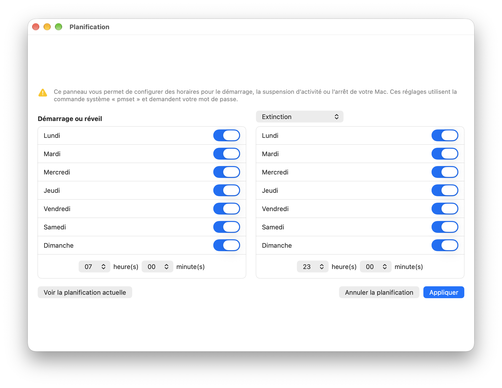

# Planification

A small macOS app to schedule your Mac's **start-up / wake** and **shutdown / sleep / restart** at fixed times — a lightweight, focused alternative to OnyX's *Scheduling* panel.

Under the hood it is a graphical front end for the built-in macOS command [`pmset repeat`](https://ss64.com/osx/pmset.html).

## Screenshots

| English | French |
| :---: | :---: |
|  |  |

The app is localized and automatically follows the system language.

## Features

- Schedule a **wake or power-on** time and a **shutdown / sleep / restart** time.
- Per-day toggles (Monday → Sunday) for each event.
- Hour / minute pickers for both events.
- Reads the Mac's current schedule on launch and pre-fills the interface.
- **Show current schedule** and **Cancel schedule** actions.
- Localized in **English** and **French** (follows the system language).

## How it works

When you press **Apply**, the app builds and runs a command such as:

```bash
sudo pmset repeat wakeorpoweron MTWRFSU 07:00:00 shutdown MTWRFSU 23:00:00
```

Day codes: `M`=Monday, `T`=Tuesday, `W`=Wednesday, `R`=Thursday, `F`=Friday, `S`=Saturday, `U`=Sunday.

Because `pmset` requires administrator rights, the app runs the command through an AppleScript `do shell script … with administrator privileges`, which triggers the standard macOS password prompt. **Show current schedule** uses `pmset -g sched` and needs no password.

You can inspect or clear the schedule yourself from Terminal:

```bash
pmset -g sched          # view the current schedule
sudo pmset repeat cancel # remove all repeating events
```

## Requirements

- macOS (Apple silicon or Intel)
- Xcode 16 or later to build
- The **App Sandbox is disabled** for this target — it is required so the app can run `pmset` with administrator privileges.

## Build & run

1. Open `Planification.xcodeproj` in Xcode.
2. Select the **Planification** scheme.
3. Build and run (`⌘R`).

Or from the command line:

```bash
xcodebuild -project Planification.xcodeproj -scheme Planification -configuration Debug build
```

## Usage

1. In each column, enable the days you want.
2. Set the hour and minute for the wake event (left) and the end-of-day event (right).
3. Choose the end-of-day action from the pop-up: **Shut Down**, **Sleep**, or **Restart**.
4. Click **Apply** and enter your administrator password.

> **Note:** macOS allows only **one** repeating wake time and **one** repeating end-of-day time; you choose which days they apply to. For a scheduled power-on to work, the Mac must be connected to power.

## Project structure

| File | Purpose |
| --- | --- |
| `PlanificationApp.swift` | App entry point. |
| `ContentView.swift` | The scheduling interface (two-column layout). |
| `PowerScheduler.swift` | Builds, runs, reads, and parses `pmset repeat` schedules. |
| `Localizable.xcstrings` | String Catalog with English and French translations. |

## Localization

All user-facing text lives in `Localizable.xcstrings`. English is the source language; French is provided. To add another language, open the catalog in Xcode, click **+**, and translate each entry.

## License

No license specified yet.
